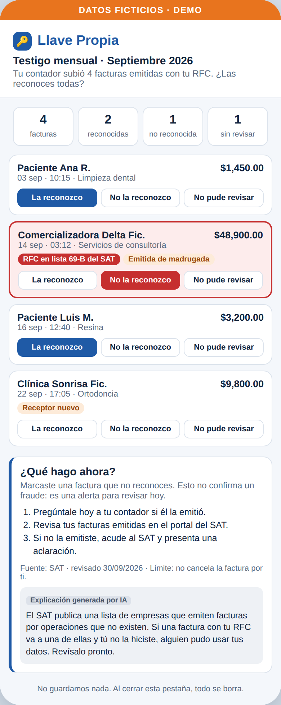
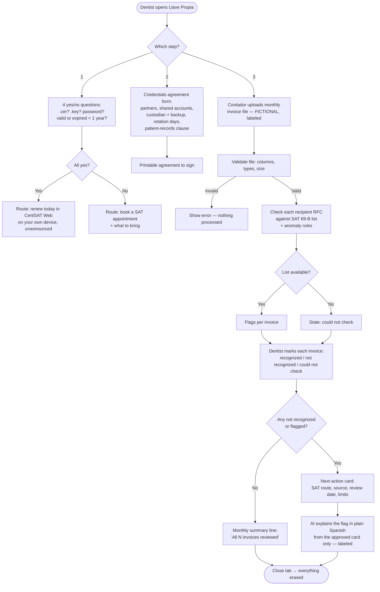
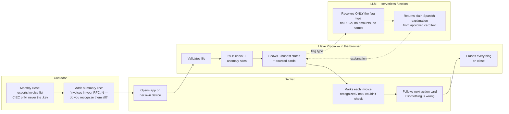

# PACKET — Llave Propia
**Week 8 · Business Bending · Fátima Fortes (Operator) · Team 6**
Declared vacuum: **SME Shield** (fiscal identity) · Honors Blueprint **Condition 4**, and all six conditions (C1 = shadow clause)

---

## 1. The problem, in my words

A small dental practice in Mexico City protects its patients' teeth better than it protects its own tax identity. Each dentist's e.firma (.cer + .key + password) usually lives with the contador, in an email thread or on a USB stick, because the contador asked for it years ago. The e.firma is non-repudiable: whatever is signed with it is legally the dentist's act, even if someone else signed it. And nobody checks. Fake invoices issued in her RFC can sit unnoticed for months, until SAT treats them as *her* evasion.

The practice won't adopt a new security habit. But it already has a monthly event with a witness: **the contador's monthly close.** Llave Propia attaches security to that event instead of asking anyone to "do security."

## 2. Exact user

- **Primary user:** an associated dentist and co-owner of a shared practice in Mexico City (3–4 dentists, one receptionist, one external contador). Uses WhatsApp all day, has 5 minutes between patients, doesn't know where her .key is. *(Based on one real practice, a family contact — a single case, not user research.)*
- **Second actor:** the practice's contador, who already sends a monthly summary and uploads that month's invoice list.
- **Not the user:** the receptionist. She is never made the owner of the risk (Condition 4).

## 3. Success definition

**Before the module closes, at the live URL, a dentist can:**
1. answer 4 yes/no questions and get her correct e.firma route (renew online today in CertiSAT Web, or book a SAT appointment) in under one minute, **without ever uploading a file**;
2. fill the credentials agreement and get a printable document ready for the partners to sign;
3. review a **fictional, labeled** month of invoices, see which ones are flagged (SAT 69-B public list + simple anomaly rules), mark each one *recognized / not recognized / could not check*, and get a **sourced, dated next-action card** for anything she doesn't recognize, with a plain-Spanish explanation labeled as AI-generated;

…**and nothing is stored anywhere** after the tab closes.

## 4. Mockup (image-generated)

*Generated with an image model from this prompt:* "Clean mobile web app screen in Spanish for a Mexican dental practice, titled 'Llave Propia — Testigo mensual'. Top banner in orange: 'DATOS FICTICIOS · DEMO'. A list of 6 invoices, each row with date, client name, amount in MXN and three buttons: 'La reconozco', 'No la reconozco', 'No pude revisar'. One row highlighted in red with a tag 'RFC en lista 69-B del SAT'. Below, a card titled '¿Qué hago ahora?' with 3 numbered steps, a small line 'Fuente: SAT · revisado 30/09/2026', and a grey label 'Explicación generada por IA'. Calm blue and white palette, large readable text, no logos."

## 5. The flow

### 5a. Flowchart — how the feature works

### 5b. Swimlane — who does what

## 6. Benchmark line

- **The best existing solution on Earth for this is** Australia's ATO client-to-agent linking: the client authorizes the accountant through the tax platform, so the accountant never needs the client's credentials — and the ATO reports no successful fraud through compromised agents' client lists since it became mandatory.
- **Mine differs by** localizing it to a Mexico where SAT has no delegation layer (the contador logs in with the client's CIEC): instead of fixing access, I make each dentist keep her own key and **witness the consequences** every month — checking the invoices issued in her RFC against SAT's own public 69-B list, inside the contador's existing monthly close.

## 7. The long view (3 years)

If this slice works, Llave Propia becomes the monthly "fiscal identity check" that contadores and professional associations (ADM, colegios) offer their members, and that insurers could require before selling cyber cover to micro-businesses. It would add the other half of the SME Shield — the owner-verified website and email scan from my team — and the breach-victim next-action cards as the "after." And it would produce the one thing Mexico lacks today: visible evidence of identity-driven fake invoices, the pressure that could push SAT to build Australia-style delegation — at which point my workaround should retire.

## 8. Scope cut — what I am NOT building

- No connection to SAT systems, no scraping, no login to anything of SAT's.
- No upload of .cer/.key files, passwords, CIEC, CURP, biometrics or bank data — ever.
- No real invoices. Demo data is fictional and labeled on screen.
- No accounts, no database, no stored agreements (nothing to protect = nothing to leak).
- No clinical records (NOM-004) — out of scope, flagged in the agreement clause only.
- No "you are safe" badge, no 0–100 score, no promise of recovery.
- No contador-side dashboard (the contador only produces the file this week).

## 9. Architecture + stack

| Layer | Choice (free) | Why |
|---|---|---|
| Frontend | Vite + React, static | Runs in the browser, so invoice data never leaves the device |
| Hosting | Vercel (free) | Required deploys; env vars for the one secret |
| LLM | Gemini API free tier via one Vercel serverless function | Key stays server-side; receives only the flag type |
| Security data | SAT 69-B public list (datos abiertos), converted to a JSON of RFCs at build time, snapshot date shown | Real public fraud data; if missing → "could not check" |
| Anomaly rules | Plain JS rules (unknown recipient, amount > 3× monthly median, issued 00:00–05:00) | Transparent, testable, no black box |
| Structured data | Fictional invoice CSV (simulated, labeled) | Allowed by the stack floor; zero real data |
| Agreement | Generated in-browser, printed with the browser's Print → PDF | No storage needed |
| Repo | GitHub, DECISIONS.md, session closes | Required evidence |

**Security floor:** no secrets in code (API key only in Vercel env vars) · no personal data stored, so no auth or database is needed (documented as a design decision; if storage is ever added → Supabase Auth with Google + RLS first) · every input validated (file type, size ≤ 200 KB, required columns, RFC format, text length limits) · the LLM never receives raw file content · demo data invented and labeled.

## 10. Test plan

| # | Test | Expected |
|---|---|---|
| T1 | Renewal check: all "yes" | Route = CertiSAT Web online renewal, with source + date |
| T2 | Renewal check: any "no" (e.g., lost .key) | Route = SAT appointment, with what to bring |
| T3 | Agreement with 1 and with 4 partners | Printable document lists every account with custodian + backup |
| T4 | Upload the fictional sample file | Every invoice shown; the planted demo RFC is flagged "69-B" |
| T5 | 69-B list fails to load | Every invoice shows "could not check," never "OK" |
| T6 | Upload a wrong file (image, empty CSV, missing column, 2 MB) | Clear error, nothing processed |
| T7 | Mark an invoice "not recognized" | Next-action card appears with source, date and limits |
| T8 | AI explanation | Labeled "Explicación generada por IA"; request payload contains no RFC, amount or name |
| T9 | Reload / close tab | Nothing remains (no localStorage, no network storage) |
| T10 | Secrets | Repo search finds no API key; key only in Vercel env |
| T11 | Phone width (375 px) | Usable with one thumb; text readable |

**Persona test (separate fresh chat):** Dra. Lupita, 52, co-owner of a shared practice in CDMX; lives in WhatsApp; doesn't know where her .key is and fully trusts her contador; 5 minutes between patients; closes anything confusing without saying so.

## Conditions honored (Blueprint, Team 6)

| Condition | How Llave Propia honors it |
|---|---|
| **C1 Shadow — no concentration** | Never asks for any credential; nothing stored; no cross-business data; LLM gets only the flag type |
| C2 Honest states | Only *recognized / not recognized / could not check*; no green badge, no score |
| C3 Serious cases reach a human | Card names the institution to contact; no promise of recovery |
| **C4 Existing events, witnessed** | Built on the contador's monthly close; receptionist never owns the risk |
| C5 Local, sourced, dated | SAT / CertiSAT routes only, each with source and review date |
| C6 Beat the free incumbent or don't claim value | Pilot only; compared against "SAT portal alone" in the demo; no revenue claim |
